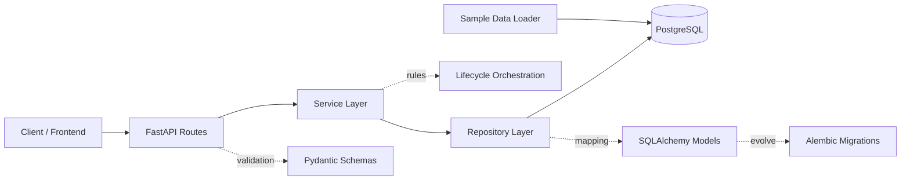
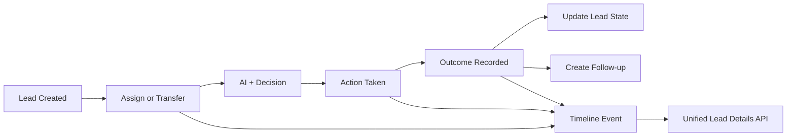

# Backend Project Handbook

Generated: 2026-09-07 21:10:53 UTC

## 1. Executive Summary

This backend is a lead-centric sales intelligence system built on FastAPI, SQLAlchemy, Alembic, and PostgreSQL.
The lead is the central business entity and is connected to customer, campaign, journey, engagement, call, task, follow-up, AI prediction, and decision modules.

## 2. Architecture

- API Layer: app/api/routes
- Service Layer: app/services
- Repository Layer: app/repositories
- Persistence Layer: app/models + PostgreSQL
- Schema Contracts: app/schemas
- DB Evolution: Alembic migrations

Request flow:

```text
Client -> Route -> Service -> Repository -> DB
                         -> business rules -> response schema
```

Architecture Diagram (Mermaid):



## 3. Feature Modules

1. Health + Dashboard
2. Customers
3. Leads
4. Products
5. Campaigns
6. Engagement Channels
7. Website Journey
8. Calls
9. Tasks + Follow-ups
10. Data Import + Export
11. ML Training + Model Catalog
12. AI Predictions
13. Decision Engine
14. Analytics
15. Reports
16. Lead Lifecycle (assignment, transfer, outcomes, timeline, details)

## 4. Data Processing

1. Source data is loaded from backend/sample_data.xlsx using scripts/preload_sample_data.py.
2. The loader maps grouped records into products, campaigns, customers, leads, tasks, follow-ups, calls, engagement events, and website events.
3. Live APIs use these persisted records, not synthetic smoke values.
4. AI endpoints score/segment leads and store prediction logs.
5. Decision endpoint combines predictions + rules into next action recommendations.
6. Lifecycle module adds assignment/transfer, outcome tracking, and timeline events to create a connected business workflow.
7. Unified lead details endpoint aggregates lead + customer + campaign + engagement + AI + operational activity for frontend rendering.

### 4.1 Sample Data Columns (sample_data.xlsx)

Total columns in dataset sheet: 91

1. Customer_ID
2. CRM_Channel
3. CRM_Department
4. CRM_Lead_Type
5. CRM_Lead_Source
6. CRM_Data_Medium
7. CRM_Source
8. CRM_Data_Source_Platform
9. CRM_Product_Code
10. CRM_Product_Name
11. CRM_UTM_Source
12. CRM_UTM_Medium
13. CRM_UTM_Campaign
14. CRM_Gender
15. CRM_Age_Band
16. CRM_Income_Band
17. CRM_Occupation
18. CRM_Education
19. CRM_Tobacco_User
20. CRM_NonResident_Flag
21. CRM_Existing_Plan_Flag
22. CRM_Lead_Create_Hour
23. CRM_Lead_Create_DayOfWeek
24. CRM_Lead_Create_Weekend
25. CRM_Lead_Create_Month
26. CRM_Days_Create_To_Update
27. CRM_Contact_Count
28. CRM_NonContact_Count
29. CRM_No_Of_Attempts
30. CRM_Has_Application_No
31. CRM_Has_Payment_Flag
32. CDR_Total_Calls
33. CDR_Connected_Calls
34. CDR_Connect_Rate
35. CDR_Total_Talk_Sec
36. CDR_Avg_Talk_Sec
37. CDR_Max_Talk_Sec
38. CDR_Distinct_Call_Days
39. CDR_Distinct_Agents
40. CDR_Callbacks_Scheduled
41. CDR_Inbound_Calls
42. CDR_Top_Call_Status
43. CDR_Top_Q_Type
44. CDR_First_Call_Delay_Days
45. CDR_Call_Span_Days
46. MSG_Campaigns_Targeted
47. MSG_Sent
48. MSG_Delivered
49. MSG_Read
50. MSG_Clicked
51. MSG_Replied
52. MSG_Failed
53. MSG_Engaged
54. WEB_Tracked
55. Visits
56. Page_Views
57. Total_Seconds_Spent
58. ev_Lead_Creation
59. ev_Lead_Submitted
60. ev_Calculator_Start
61. ev_Retrieve_Quote
62. ev_Quote_Proceed
63. ev_Personal_Details_Next
64. ev_Plan_Details_Load
65. ev_Make_Payment_Load
66. ev_Pay_Now
67. ev_Payment_Success
68. ev_Payment_Failure
69. ev_Proposal_Form_Load
70. ev_Proposal_Form_Proceed
71. ev_Generate_OTP
72. ev_OTP_Submit
73. ev_Brochure_Download
74. ev_Connect_With_Expert
75. ev_Page_Scroll_25
76. ev_Page_Scroll_95
77. WEB_Step_Name
78. WEB_Step_Number
79. WEB_New_Vs_Repeat
80. WEB_Plan_Type
81. WEB_Plan_Variant
82. WEB_Quoted_Price
83. WEB_Coverage_Amount
84. WEB_Payment_Frequency
85. WEB_Last_Touch_Channel
86. WEB_UTM_Source
87. WEB_Device_Type
88. Label_Source_Disposition
89. Label_Source_Lead_Status
90. Label_Basis
91. LABEL_Customer_Validity

### 4.2 Column Meaning (data_dictionary sheet)

- Customer_ID | source=generated | Random anonymized row id (mapping kept outside the dataset)
- CRM_Channel | source=CRM CHANNEL | Acquisition channel of the lead
- CRM_Department | source=CRM DEPARTMENT | Owning department
- CRM_Lead_Type | source=CRM LEAD_TYPE | Lead type code
- CRM_Lead_Source | source=CRM LEAD_SOURCE | Source system/partner of the lead
- CRM_Data_Medium | source=CRM DATA_MEDIUM | Data medium code
- CRM_Source | source=CRM SOURCE | Combined source string
- CRM_Data_Source_Platform | source=CRM P_DATA_SOURCE | Platform that generated the lead (e.g. PARTNER_APP)
- CRM_Product_Code | source=CRM PROD_ID | Product id attached to the lead
- CRM_Product_Name | source=CRM PRODUCT_NAME | Product name if recorded
- CRM_UTM_Source | source=CRM MISC_UTM_SOURCE | Marketing UTM source
- CRM_UTM_Medium | source=CRM MISC_UTM_MEDIUM | Marketing UTM medium
- CRM_UTM_Campaign | source=CRM MISC_UTM_CAMPAIGN | Marketing UTM campaign
- CRM_Gender | source=CRM CUST_GENDER | Declared gender (demographic, non-identifying)
- CRM_Age_Band | source=CRM CUST_AGE (banded) | Age banded: 18-25/26-35/36-45/46-55/56+/Unknown
- CRM_Income_Band | source=CRM ANNUAL_INCOME (banded) | Annual income banded: <3L/3-5L/5-10L/10-25L/25L+/Unknown
- CRM_Occupation | source=CRM OCCUPATION | Declared occupation
- CRM_Education | source=CRM EDUCATION | Declared education
- CRM_Tobacco_User | source=CRM TOBACCO_USER | Tobacco user flag Y/N
- CRM_NonResident_Flag | source=CRM NonResident_FLAG | NonResident flag
- CRM_Existing_Plan_Flag | source=CRM EXISTING_PLAN_PRODUCT | Existing plan product if any
- CRM_Lead_Create_Hour | source=CRM LEAD_CREATE_DATE (derived) | Hour of day the lead was created (0-23)
- CRM_Lead_Create_DayOfWeek | source=CRM LEAD_CREATE_DATE (derived) | Day of week of lead creation
- CRM_Lead_Create_Weekend | source=CRM LEAD_CREATE_DATE (derived) | 1 if created on Sat/Sun
- CRM_Lead_Create_Month | source=CRM LEAD_CREATE_DATE (derived) | Creation month YYYY-MM
- CRM_Days_Create_To_Update | source=CRM dates (derived) | Days between lead creation and last update
- CRM_Contact_Count | source=CRM CNT_COUNT | CRM-recorded contact count
- CRM_NonContact_Count | source=CRM NCNT_COUNT | CRM-recorded non-contact count
- CRM_No_Of_Attempts | source=CRM NO_OF_ATTEMPTS | CRM-recorded attempt count
- CRM_Has_Application_No | source=CRM APPLICATION_NO (flag) | 1 if an application number exists (id itself dropped)
- CRM_Has_Payment_Flag | source=CRM COLL_AMOUNT (flag) | 1 if payment was collected (amount dropped)
- CDR_Total_Calls | source=CDR Apr-Jun (agg) | Total dialer call records for this lead
- CDR_Connected_Calls | source=CDR (agg) | Calls with duration > 0 (a recording exists for these)
- CDR_Connect_Rate | source=CDR (agg) | Connected / total calls
- CDR_Total_Talk_Sec | source=CDR (agg) | Sum of call durations in seconds
- CDR_Avg_Talk_Sec | source=CDR (agg) | Average duration of connected calls
- CDR_Max_Talk_Sec | source=CDR (agg) | Longest single call in seconds
- CDR_Distinct_Call_Days | source=CDR (agg) | Number of distinct days the lead was called
- CDR_Distinct_Agents | source=CDR (agg) | Distinct agent count (ids dropped)
- CDR_Callbacks_Scheduled | source=CDR Callback Time (agg) | Calls with a callback scheduled
- CDR_Inbound_Calls | source=CDR Call Direction (agg) | Inbound call count
- CDR_Top_Call_Status | source=CDR Call Status (agg) | Most frequent call status
- CDR_Top_Q_Type | source=CDR Q Type (agg) | Most frequent queue type
- CDR_First_Call_Delay_Days | source=CDR + CRM (derived) | Days from lead creation to first call
- CDR_Call_Span_Days | source=CDR (derived) | Days between first and last call
- MSG_Campaigns_Targeted | source=camp messaging (agg via customer key) | Distinct messaging campaigns that targeted this customer
- MSG_Sent | source=camp (agg) | Messages sent
- MSG_Delivered | source=camp (agg) | Messages delivered
- MSG_Read | source=camp (agg) | Messages read
- MSG_Clicked | source=camp (agg) | Link clicks
- MSG_Replied | source=camp (agg) | Replies
- MSG_Failed | source=camp (agg) | Failed + bounced messages
- MSG_Engaged | source=camp (derived) | 1 if any read/click/reply
- WEB_Tracked | source=WEB var5 (derived) | 1 if this lead had website activity (Apr-May window)
- Visits | source=WEB metrics | Web visits attributed to the lead id
- Page_Views | source=WEB metrics | Page views
- Total_Seconds_Spent | source=WEB metrics | Total seconds on site
- ev_* | source=WEB funnel events | Funnel event counts: lead creation/submission, calculator, quote, payment, proposal, OTP, brochure, expert-connect, scroll depth
- WEB_Step_Name | source=WEB var31 | Furthest journey step name recorded
- WEB_Step_Number | source=WEB var86 | Step number
- WEB_New_Vs_Repeat | source=WEB var3 | New vs repeat visitor
- WEB_Plan_Type | source=WEB var35 | Plan type explored
- WEB_Plan_Variant | source=WEB var105 | Plan variant explored
- WEB_Quoted_Price | source=WEB var90 | Top quoted price
- WEB_Coverage_Amount | source=WEB var91 | Top quoted coverage amount
- WEB_Payment_Frequency | source=WEB var97 | Payment frequency chosen
- WEB_Last_Touch_Channel | source=WEB lasttouchchannel | Last marketing touch channel
- WEB_UTM_Source | source=WEB campaign.utm-source | Web UTM source
- WEB_Device_Type | source=WEB mobiledevicetype | Device type used
- Label_Source_Disposition | source=CRM DISPOSITION | Raw disposition the label was derived from (drop before training to avoid leakage)
- Label_Source_Lead_Status | source=CRM LEAD_STATUS | Raw lead status (drop before training to avoid leakage)
- Label_Basis | source=derived | Which rule produced the label: conversion fields / disposition / lead_status
- LABEL_Customer_Validity | source=derived | TARGET: 0=junk/unreachable, 1=contactable not interested/eligible, 2=interested, 3=converted

### 4.3 Column To API Field Mapping

- Customer_ID -> customers.external_customer_id -> returned in /api/customers and /api/leads/{id}/details.customer
- CRM_Product_Code/CRM_Product_Name -> products.code/products.name -> returned in /api/products and details.campaign linkage
- CRM_UTM_Campaign/CRM_Data_Source_Platform -> campaigns.code/name -> returned in /api/campaigns
- CRM_Channel/CRM_Data_Medium/CRM_Source -> leads.source_channel/source_medium/current_handler
- Label_Source_Lead_Status/Label_Source_Disposition -> leads.status/recommended_action
- LABEL_Customer_Validity/CDR_Connect_Rate/Page_Views/MSG_Engaged -> leads.lead_score
- CRM_Department -> leads.current_section and lifecycle assignment.to_section
- CDR_* metrics -> calls and engagement event payloads
- WEB_* metrics -> website_events fields and payload
- Label_Basis/Disposition -> task descriptions + followup notes + timeline details

## 5. How To Run In Detail

1. Create backend-local virtual environment and install requirements.
2. Configure .env with DATABASE_URL for PostgreSQL.
3. Run migrations: ./.venv/bin/alembic upgrade head
4. Preload real dataset: ./.venv/bin/python scripts/preload_sample_data.py --reset
5. Start API server: ./.venv/bin/uvicorn app.main:app --host 0.0.0.0 --port 8000
6. Open Swagger: /api/docs and OpenAPI: /api/openapi.json
7. Run smoke verification: ./.venv/bin/python scripts/live_api_smoke.py
8. Run tests: ./.venv/bin/pytest -q
9. Lifecycle-only test: ./.venv/bin/pytest -q tests/test_lead_lifecycle.py

## 6. Feature Workflows And Handling

1. Lead intake: create lead -> initial timeline event -> assignment queue.
2. Assignment/transfer: updates current owner and section; previous assignment marked non-current.
3. AI scoring: prediction APIs persist score outputs per prediction type.
4. Decisioning: next action recommendation combines prediction signal and business logic.
5. Outcome handling: captures result, updates lead stage/status, optionally creates follow-up, and appends timeline events.
6. Reporting: analytics/reports endpoints query aggregated module-level data for operational monitoring.

Lifecycle Diagram (Mermaid):



## 7. API Inventory And Response Contracts

Total API paths in OpenAPI: 62

### POST /api/ai/analyze-lead
- Summary: Analyze Lead
- Tags: ai
- Request: body=context, customer_id, lead_id
- Responses: 200: customer_id, generated_at, lead_id, predictions | 422: detail

### POST /api/ai/conversion
- Summary: Predict Conversion
- Tags: ai
- Request: body=context, customer_id, lead_id
- Responses: 200: details, label, model_name, prediction_type, rationale, score | 422: detail

### GET /api/ai/customers/{customer_id}
- Summary: Get Customer Predictions
- Tags: ai
- Request: params=customer_id(path)
- Responses: 200: items[created_at], items[customer_id], items[details], items[id], items[label], items[lead_id], items[model_name], items[prediction_type], ... | 422: detail

### POST /api/ai/intent
- Summary: Predict Intent
- Tags: ai
- Request: body=context, customer_id, lead_id
- Responses: 200: details, label, model_name, prediction_type, rationale, score | 422: detail

### POST /api/ai/lead-score
- Summary: Predict Lead Score
- Tags: ai
- Request: body=context, customer_id, lead_id
- Responses: 200: details, label, model_name, prediction_type, rationale, score | 422: detail

### GET /api/ai/leads/{lead_id}
- Summary: Get Lead Predictions
- Tags: ai
- Request: params=lead_id(path)
- Responses: 200: items[created_at], items[customer_id], items[details], items[id], items[label], items[lead_id], items[model_name], items[prediction_type], ... | 422: detail

### POST /api/ai/next-best-action
- Summary: Predict Next Action
- Tags: ai
- Request: body=context, customer_id, lead_id
- Responses: 200: details, label, model_name, prediction_type, rationale, score | 422: detail

### POST /api/ai/product-recommendation
- Summary: Predict Product
- Tags: ai
- Request: body=context, customer_id, lead_id
- Responses: 200: details, label, model_name, prediction_type, rationale, score | 422: detail

### POST /api/ai/segment
- Summary: Predict Segment
- Tags: ai
- Request: body=context, customer_id, lead_id
- Responses: 200: details, label, model_name, prediction_type, rationale, score | 422: detail

### POST /api/ai/validity
- Summary: Predict Validity
- Tags: ai
- Request: body=context, customer_id, lead_id
- Responses: 200: details, label, model_name, prediction_type, rationale, score | 422: detail

### GET /api/analytics/channels
- Summary: Get Channels
- Tags: analytics
- Request: none
- Responses: 200: items

### GET /api/analytics/funnel
- Summary: Get Funnel
- Tags: analytics
- Request: none
- Responses: 200: conversion_rate, converted_leads, lost_leads, new_leads, qualified_leads, total_leads

### GET /api/analytics/overview
- Summary: Get Overview
- Tags: analytics
- Request: none
- Responses: 200: conversion_rate, converted_leads, open_tasks, pending_followups, total_calls, total_campaigns, total_customers, total_leads

### GET /api/calls
- Summary: List Calls
- Tags: calls
- Request: params=skip(query), limit(query), lead_id(query), customer_id(query), status_filter(query)
- Responses: 200: items[created_at], items[customer_id], items[direction], items[duration_seconds], items[ended_at], items[id], items[lead_id], items[notes], ... | 422: detail

### POST /api/calls
- Summary: Create Call
- Tags: calls
- Request: body=customer_id, direction, lead_id, notes, phone_number, scheduled_at, status
- Responses: 201: created_at, customer_id, direction, duration_seconds, ended_at, id, lead_id, notes, ... | 422: detail

### GET /api/calls/{call_id}
- Summary: Get Call
- Tags: calls
- Request: params=call_id(path)
- Responses: 200: created_at, customer_id, direction, duration_seconds, ended_at, id, lead_id, notes, ... | 422: detail

### PATCH /api/calls/{call_id}
- Summary: Update Call
- Tags: calls
- Request: params=call_id(path) ; body=customer_id, direction, lead_id, notes, phone_number, scheduled_at, status
- Responses: 200: created_at, customer_id, direction, duration_seconds, ended_at, id, lead_id, notes, ... | 422: detail

### DELETE /api/calls/{call_id}
- Summary: Delete Call
- Tags: calls
- Request: params=call_id(path)
- Responses: 204: Successful Response | 422: detail

### POST /api/calls/{call_id}/end
- Summary: End Call
- Tags: calls
- Request: params=call_id(path) ; body=ended_at, notes
- Responses: 200: created_at, customer_id, direction, duration_seconds, ended_at, id, lead_id, notes, ... | 422: detail

### POST /api/calls/{call_id}/start
- Summary: Start Call
- Tags: calls
- Request: params=call_id(path) ; body=started_at
- Responses: 200: created_at, customer_id, direction, duration_seconds, ended_at, id, lead_id, notes, ... | 422: detail

### GET /api/campaigns
- Summary: List Campaigns
- Tags: campaigns
- Request: params=skip(query), limit(query)
- Responses: 200: items[channel], items[code], items[created_at], items[end_date], items[id], items[name], items[start_date], items[status], ... | 422: detail

### POST /api/campaigns
- Summary: Create Campaign
- Tags: campaigns
- Request: body=channel, code, end_date, name, start_date, status
- Responses: 201: channel, code, created_at, end_date, id, name, start_date, status, ... | 422: detail

### GET /api/campaigns/{campaign_id}
- Summary: Get Campaign
- Tags: campaigns
- Request: params=campaign_id(path)
- Responses: 200: channel, code, created_at, end_date, id, name, start_date, status, ... | 422: detail

### PATCH /api/campaigns/{campaign_id}
- Summary: Update Campaign
- Tags: campaigns
- Request: params=campaign_id(path) ; body=channel, code, end_date, name, start_date, status
- Responses: 200: channel, code, created_at, end_date, id, name, start_date, status, ... | 422: detail

### DELETE /api/campaigns/{campaign_id}
- Summary: Delete Campaign
- Tags: campaigns
- Request: params=campaign_id(path)
- Responses: 204: Successful Response | 422: detail

### GET /api/campaigns/{campaign_id}/leads
- Summary: List Campaign Leads
- Tags: campaigns
- Request: params=campaign_id(path), skip(query), limit(query)
- Responses: 200: items[campaign_id], items[created_at], items[current_handler], items[current_section], items[current_stage], items[customer_id], items[id], items[lead_score], ... | 422: detail

### GET /api/campaigns/{campaign_id}/performance
- Summary: Get Campaign Performance
- Tags: campaigns
- Request: params=campaign_id(path)
- Responses: 200: by_channel, by_metric, campaign_id, total_events | 422: detail

### GET /api/customers
- Summary: List Customers
- Tags: customers
- Request: params=skip(query), limit(query)
- Responses: 200: items[CRM_Age_Band], items[CRM_Education], items[CRM_Existing_Plan_Flag], items[CRM_Gender], items[CRM_Income_Band], items[CRM_NonResident_Flag], items[CRM_Occupation], items[CRM_Tobacco_User], ... | 422: detail

### POST /api/customers
- Summary: Create Customer
- Tags: customers
- Request: body=crm_age_band, crm_education, crm_existing_plan_flag, crm_gender, crm_income_band, crm_nonresident_flag, crm_occupation, crm_tobacco_user, email, external_customer_id, ...
- Responses: 201: CRM_Age_Band, CRM_Education, CRM_Existing_Plan_Flag, CRM_Gender, CRM_Income_Band, CRM_NonResident_Flag, CRM_Occupation, CRM_Tobacco_User, ... | 422: detail

### GET /api/customers/{customer_id}
- Summary: Get Customer
- Tags: customers
- Request: params=customer_id(path)
- Responses: 200: CRM_Age_Band, CRM_Education, CRM_Existing_Plan_Flag, CRM_Gender, CRM_Income_Band, CRM_NonResident_Flag, CRM_Occupation, CRM_Tobacco_User, ... | 422: detail

### PATCH /api/customers/{customer_id}
- Summary: Update Customer
- Tags: customers
- Request: params=customer_id(path) ; body=crm_age_band, crm_education, crm_existing_plan_flag, crm_gender, crm_income_band, crm_nonresident_flag, crm_occupation, crm_tobacco_user, email, external_customer_id, ...
- Responses: 200: CRM_Age_Band, CRM_Education, CRM_Existing_Plan_Flag, CRM_Gender, CRM_Income_Band, CRM_NonResident_Flag, CRM_Occupation, CRM_Tobacco_User, ... | 422: detail

### DELETE /api/customers/{customer_id}
- Summary: Delete Customer
- Tags: customers
- Request: params=customer_id(path)
- Responses: 204: Successful Response | 422: detail

### GET /api/dashboard
- Summary: Get Dashboard
- Tags: dashboard
- Request: none
- Responses: 200: conversion_rate, converted_leads, open_tasks, pending_followups, total_calls, total_campaigns, total_customers, total_leads

### POST /api/data/export
- Summary: Export Data
- Tags: data
- Request: body=file_format, resource
- Responses: 201: file_format, file_path, job_id, resource, row_count, status | 422: detail

### GET /api/data/history
- Summary: Get Data History
- Tags: data
- Request: params=skip(query), limit(query)
- Responses: 200: items[completed_at], items[created_at], items[dataset_name], items[details], items[error_message], items[id], items[invalid_row_count], items[row_count], ... | 422: detail

### POST /api/data/import
- Summary: Import Data
- Tags: data
- Request: body=dataset_name, file_format, source_path
- Responses: 201: completed_at, created_at, dataset_name, details, error_message, id, invalid_row_count, row_count, ... | 422: detail

### GET /api/data/import/{job_id}
- Summary: Get Import Job
- Tags: data
- Request: params=job_id(path)
- Responses: 200: completed_at, created_at, dataset_name, details, error_message, id, invalid_row_count, row_count, ... | 422: detail

### GET /api/data/quality
- Summary: Get Data Quality
- Tags: data
- Request: none
- Responses: 200: completeness, generated_at, table_counts

### GET /api/data/validation
- Summary: Get Data Validation
- Tags: data
- Request: none
- Responses: 200: generated_at, issues, total_issues

### GET /api/decision/customers/{customer_id}
- Summary: Get Customer Decisions
- Tags: decision
- Request: params=customer_id(path)
- Responses: 200: items[confidence], items[created_at], items[customer_id], items[decision_type], items[id], items[inputs], items[lead_id], items[priority], ... | 422: detail

### GET /api/decision/leads/{lead_id}
- Summary: Get Lead Decisions
- Tags: decision
- Request: params=lead_id(path)
- Responses: 200: items[confidence], items[created_at], items[customer_id], items[decision_type], items[id], items[inputs], items[lead_id], items[priority], ... | 422: detail

### POST /api/decision/next-action
- Summary: Decide Next Action
- Tags: decision
- Request: body=customer_id, lead_id
- Responses: 200: confidence, decision_type, inputs, priority, rationale, recommended_action | 422: detail

### GET /api/engagement/email
- Summary: List Email Events
- Tags: engagement
- Request: params=skip(query), limit(query), lead_id(query), customer_id(query), campaign_id(query)
- Responses: 200: items[campaign_id], items[channel], items[customer_id], items[event_payload], items[event_time], items[id], items[lead_id], items[metric_type], ... | 422: detail

### GET /api/engagement/rcs
- Summary: List Rcs Events
- Tags: engagement
- Request: params=skip(query), limit(query), lead_id(query), customer_id(query), campaign_id(query)
- Responses: 200: items[campaign_id], items[channel], items[customer_id], items[event_payload], items[event_time], items[id], items[lead_id], items[metric_type], ... | 422: detail

### GET /api/engagement/website
- Summary: List Website Events
- Tags: engagement
- Request: params=skip(query), limit(query), lead_id(query), customer_id(query), campaign_id(query)
- Responses: 200: items[campaign_id], items[channel], items[customer_id], items[event_payload], items[event_time], items[id], items[lead_id], items[metric_type], ... | 422: detail

### GET /api/engagement/whatsapp
- Summary: List Whatsapp Events
- Tags: engagement
- Request: params=skip(query), limit(query), lead_id(query), customer_id(query), campaign_id(query)
- Responses: 200: items[campaign_id], items[channel], items[customer_id], items[event_payload], items[event_time], items[id], items[lead_id], items[metric_type], ... | 422: detail

### GET /api/followups
- Summary: List Followups
- Tags: followups
- Request: params=skip(query), limit(query), task_id(query), lead_id(query), customer_id(query)
- Responses: 200: items[channel], items[completed_at], items[created_at], items[customer_id], items[id], items[lead_id], items[notes], items[scheduled_at], ... | 422: detail

### POST /api/followups
- Summary: Create Followup
- Tags: followups
- Request: body=channel, customer_id, lead_id, notes, scheduled_at, status, task_id
- Responses: 201: channel, completed_at, created_at, customer_id, id, lead_id, notes, scheduled_at, ... | 422: detail

### PATCH /api/followups/{followup_id}
- Summary: Update Followup
- Tags: followups
- Request: params=followup_id(path) ; body=channel, completed_at, customer_id, lead_id, notes, scheduled_at, status, task_id
- Responses: 200: channel, completed_at, created_at, customer_id, id, lead_id, notes, scheduled_at, ... | 422: detail

### GET /api/health
- Summary: Health Check
- Tags: health
- Request: none
- Responses: 200: database, status

### GET /api/journey/leads/{lead_id}
- Summary: Get Lead Journey Summary
- Tags: journey
- Request: params=lead_id(path)
- Responses: 200: last_event_time, lead_id, total_events, unique_event_names | 422: detail

### GET /api/journey/website
- Summary: List Website Events
- Tags: journey
- Request: params=skip(query), limit(query), lead_id(query), customer_id(query), device_type(query)
- Responses: 200: items[customer_id], items[device_type], items[event_name], items[event_payload], items[event_time], items[id], items[is_repeat_visitor], items[lead_id], ... | 422: detail

### GET /api/leads
- Summary: List Leads
- Tags: leads
- Request: params=skip(query), limit(query), customer_id(query), campaign_id(query)
- Responses: 200: items[campaign_id], items[created_at], items[current_handler], items[current_section], items[current_stage], items[customer_id], items[id], items[lead_score], ... | 422: detail

### POST /api/leads
- Summary: Create Lead
- Tags: leads
- Request: body=campaign_id, current_handler, current_section, current_stage, customer_id, lead_score, priority, recommended_action, source_channel, source_medium, ...
- Responses: 201: campaign_id, created_at, current_handler, current_section, current_stage, customer_id, id, lead_score, ... | 422: detail

### GET /api/leads/{lead_id}
- Summary: Get Lead
- Tags: leads
- Request: params=lead_id(path)
- Responses: 200: campaign_id, created_at, current_handler, current_section, current_stage, customer_id, id, lead_score, ... | 422: detail

### PATCH /api/leads/{lead_id}
- Summary: Update Lead
- Tags: leads
- Request: params=lead_id(path) ; body=campaign_id, current_handler, current_section, current_stage, customer_id, lead_score, priority, recommended_action, source_channel, source_medium, ...
- Responses: 200: campaign_id, created_at, current_handler, current_section, current_stage, customer_id, id, lead_score, ... | 422: detail

### DELETE /api/leads/{lead_id}
- Summary: Delete Lead
- Tags: leads
- Request: params=lead_id(path)
- Responses: 204: Successful Response | 422: detail

### POST /api/leads/{lead_id}/assign
- Summary: Assign Lead
- Tags: leads
- Request: params=lead_id(path) ; body=details, reason, related_decision_id, to_handler, to_section, trigger
- Responses: 200: assignment_type, created_at, customer_id, details, from_handler, from_section, id, is_current, ... | 422: detail

### GET /api/leads/{lead_id}/calls
- Summary: Get Lead Calls
- Tags: leads
- Request: params=lead_id(path), skip(query), limit(query)
- Responses: 200: items[created_at], items[customer_id], items[direction], items[duration_seconds], items[ended_at], items[id], items[lead_id], items[notes], ... | 422: detail

### GET /api/leads/{lead_id}/details
- Summary: Get Lead Details
- Tags: leads
- Request: params=lead_id(path)
- Responses: 200: ai, assignment, calls, campaign, customer, engagement, followups, journey, ... | 422: detail

### GET /api/leads/{lead_id}/journey
- Summary: Get Lead Journey
- Tags: leads
- Request: params=lead_id(path), skip(query), limit(query)
- Responses: 200: items[customer_id], items[device_type], items[event_name], items[event_payload], items[event_time], items[id], items[is_repeat_visitor], items[lead_id], ... | 422: detail

### GET /api/leads/{lead_id}/outcomes
- Summary: List Lead Outcomes
- Tags: leads
- Request: params=lead_id(path)
- Responses: 200: items[action_type], items[created_at], items[customer_id], items[details], items[followup_required], items[id], items[lead_id], items[next_action_hint], ... | 422: detail

### POST /api/leads/{lead_id}/outcomes
- Summary: Record Lead Outcome
- Tags: leads
- Request: params=lead_id(path) ; body=action_type, details, followup_required, next_action_hint, notes, outcome_code, outcome_label
- Responses: 201: action_type, created_at, customer_id, details, followup_required, id, lead_id, next_action_hint, ... | 422: detail

### GET /api/leads/{lead_id}/timeline
- Summary: Get Lead Timeline
- Tags: leads
- Request: params=lead_id(path)
- Responses: 200: items[created_at], items[customer_id], items[details], items[event_source], items[event_type], items[id], items[lead_id] | 422: detail

### POST /api/leads/{lead_id}/transfer
- Summary: Transfer Lead
- Tags: leads
- Request: params=lead_id(path) ; body=details, reason, related_decision_id, to_handler, to_section, trigger
- Responses: 200: assignment_type, created_at, customer_id, details, from_handler, from_section, id, is_current, ... | 422: detail

### GET /api/ml/models
- Summary: List Models
- Tags: ml
- Request: params=skip(query), limit(query)
- Responses: 200: items[created_at], items[latest_job_id], items[model_name], items[status], items[training_rows] | 422: detail

### POST /api/ml/train
- Summary: Train Model
- Tags: ml
- Request: body=model_name
- Responses: 201: artifact_path, completed_at, created_at, error_message, id, metrics, model_name, status, ... | 422: detail

### GET /api/ml/train/{job_id}
- Summary: Get Training Job
- Tags: ml
- Request: params=job_id(path)
- Responses: 200: artifact_path, completed_at, created_at, error_message, id, metrics, model_name, status, ... | 422: detail

### GET /api/products
- Summary: List Products
- Tags: products
- Request: params=skip(query), limit(query)
- Responses: 200: items[category], items[code], items[created_at], items[id], items[is_active], items[name], items[updated_at] | 422: detail

### POST /api/products
- Summary: Create Product
- Tags: products
- Request: body=category, code, is_active, name
- Responses: 201: category, code, created_at, id, is_active, name, updated_at | 422: detail

### GET /api/products/{product_id}
- Summary: Get Product
- Tags: products
- Request: params=product_id(path)
- Responses: 200: category, code, created_at, id, is_active, name, updated_at | 422: detail

### PATCH /api/products/{product_id}
- Summary: Update Product
- Tags: products
- Request: params=product_id(path) ; body=category, code, is_active, name
- Responses: 200: category, code, created_at, id, is_active, name, updated_at | 422: detail

### DELETE /api/products/{product_id}
- Summary: Delete Product
- Tags: products
- Request: params=product_id(path)
- Responses: 204: Successful Response | 422: detail

### GET /api/reports/campaign-performance
- Summary: Get Campaign Performance
- Tags: reports
- Request: none
- Responses: 200: items

### GET /api/reports/pipeline
- Summary: Get Pipeline
- Tags: reports
- Request: none
- Responses: 200: converted_leads, lost_leads, new_leads, qualified_leads, total_leads

### GET /api/reports/workload
- Summary: Get Workload
- Tags: reports
- Request: none
- Responses: 200: completed_followups, completed_tasks, in_progress_tasks, open_tasks, pending_followups, total_followups, total_tasks

### GET /api/tasks
- Summary: List Tasks
- Tags: tasks
- Request: params=skip(query), limit(query), lead_id(query), customer_id(query), status_filter(query)
- Responses: 200: items[created_at], items[customer_id], items[description], items[due_at], items[id], items[lead_id], items[priority], items[status], ... | 422: detail

### POST /api/tasks
- Summary: Create Task
- Tags: tasks
- Request: body=customer_id, description, due_at, lead_id, priority, status, title
- Responses: 201: created_at, customer_id, description, due_at, id, lead_id, priority, status, ... | 422: detail

### GET /api/tasks/{task_id}
- Summary: Get Task
- Tags: tasks
- Request: params=task_id(path)
- Responses: 200: created_at, customer_id, description, due_at, id, lead_id, priority, status, ... | 422: detail

### PATCH /api/tasks/{task_id}
- Summary: Update Task
- Tags: tasks
- Request: params=task_id(path) ; body=customer_id, description, due_at, lead_id, priority, status, title
- Responses: 200: created_at, customer_id, description, due_at, id, lead_id, priority, status, ... | 422: detail

### DELETE /api/tasks/{task_id}
- Summary: Delete Task
- Tags: tasks
- Request: params=task_id(path)
- Responses: 204: Successful Response | 422: detail

### GET /health
- Summary: Health Check
- Tags: health
- Request: none
- Responses: 200: database, status

## 8. Lead Lifecycle Behavior

1. New lead creation writes lead_created event to timeline.
2. Assign/transfer updates lead ownership and section, and writes lifecycle events.
3. Outcome recording can update lead status/stage and auto-create follow-ups.
4. /leads/{id}/details returns a unified payload for frontend lead workspace rendering.

## 9. Validation Snapshot

- Test suite passing (including lifecycle tests).
- Live smoke APIs passing with real sample data preloaded.
- Lifecycle endpoints verified: timeline, details, assign, transfer, outcomes list/create.
